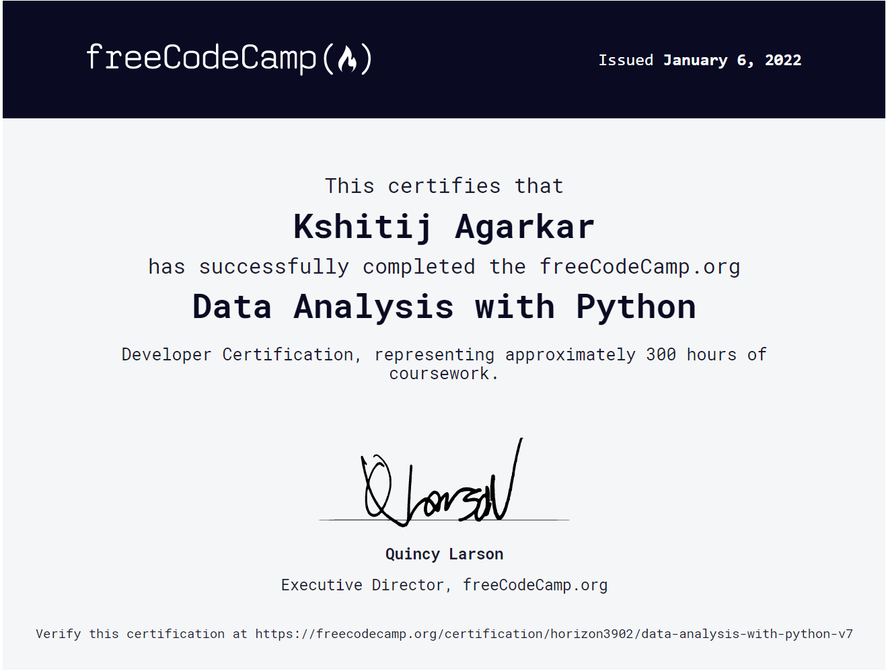

# FreeCodeCamp Data Analysis Certification Projects

These are my projects which were submitted and tested for my Data Analysis Certification on FreeCodeCamp.

[Certificate Link](https://www.freecodecamp.org/certification/horizon3902/data-analysis-with-python-v7)

### Kshitij Agarkar, IIITN, 2021

### Contact: -	

  &nbsp;&nbsp;
  &nbsp;&nbsp;
  <a href="https://github.com/horizon3902">
    

